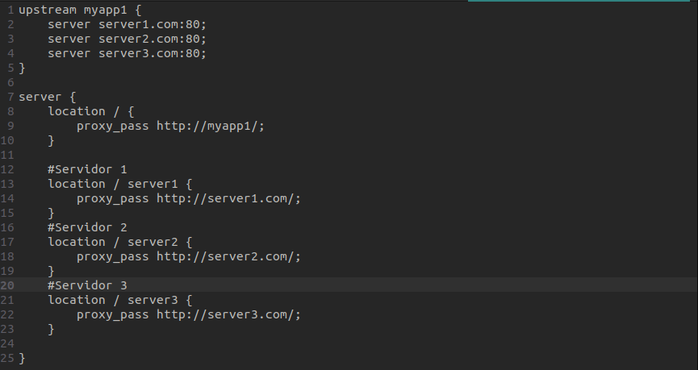
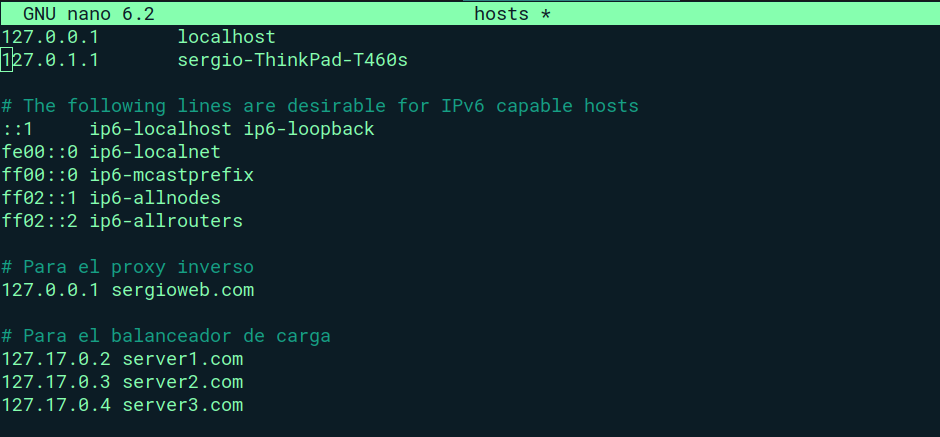

# Balanceador de CARGA NGINX

1.	Lo primero que necesitaremos es tener instalado DOCKER en nuestro equipo

3.	Crearemos en local una carpeta en la cual guardaremos los archivos html, que usaremos para realizar la prueba del balanceo de carga.

4.  Una vez hayamos creado los .html ahora el siguiente paso será levantarlos con Docker

Los comandos que utilizaremos serán los siguientes (IMP: CAMBIAR RUTA, ya que yo uso la ruta de mi equipo local)

     * docker run --rm -v /home/sergio/Documentos/UCJC/GestionDevOps/EjerciciosENTREGAFINAL/balanceador_carga_nginx/templates/index.1.html:/usr/share/nginx/html/index.html   -p 8080: 80 nginx
     * docker run --rm -v /home/sergio/Documentos/UCJC/GestionDevOps/EjerciciosENTREGAFINAL/balanceador_carga_nginx/templates/index.2.html:/usr/share/nginx/html/index.html  -p 8081: 80 nginx
     * docker run --rm -v /home/sergio/Documentos/UCJC/GestionDevOps/EjerciciosENTREGAFINAL/balanceador_carga_nginx/templates/index.3.html:/usr/share/nginx/html/index.html  -p 8082: 80 nginx

5. 	El siguiente paso será incorporar en la carpeta "hosts" que viene creada en nuestro equipo las direcciones que acabamos de crear.

6.	Para poner en funcionamiento el balanceador ejecutamos en una nueva terminal el comando: **docker run --rm -v /home/sergio/Documentos/UCJC/GestionDevOps/EjerciciosENTREGAFINAL/balanceador_carga_nginx/templates/default.conf:/etc/nginx/conf.d/default.conf -p 8085:80 nginx** lo levantaremos en el puerto 8085.

Adjunto captura con el archivo default.conf que debemos crear:

Adjunto también una carpeta de mi documento "hosts". Si dispones de un sistema operativo Ubuntu se encontrá dentro de la carpeta /etc. Es importante tener en cuenta que lo estoy realizando con mi IP.

